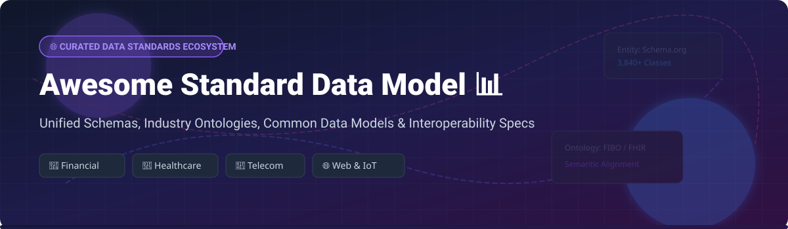

# Awesome Standard Data Model 📊

## 🌐 Top Standard Data Model Ecosystem & Interoperability Standards

 

**Curated List of Commercial SaaS Platforms, Enterprise Ontologies & Open-Source Data Standards** 🚀

*Focused on Industry Data Standards, Semantic Web Ontologies, Unified Master Data Schemas & Self-Hosted Models* 💡

**Last updated: October 2026** 📅

---

This repository tracks notable **commercial and open standard data models**, enterprise vocabularies, and **open-source GitHub projects** that define shared entities, relationships, and REST/GraphQL/gRPC data structures for interoperability across industries — from financial messaging and healthcare to retail, telecom, and the web.

**Key Ecosystem Categories**:
- 🏦 **Financial & Banking**: ISO 20022, EDMC FIBO, ACTUS
- 🏥 **Healthcare & Life Sciences**: HL7 FHIR, OHDSI OMOP CDM, CDISC
- 🏢 **Enterprise SaaS Master Data**: SAP One Domain Model, Microsoft Common Data Model
- 🌐 **Web & Cross-Domain Schemas**: Schema.org, OData, Smart Data Models (FIWARE)
- 📡 **Telecom & IoT**: TM Forum Open API, SAREF

---

## 📑 Table of Contents

- [💼 SaaS & Enterprise Hosted Platforms](#-saas--enterprise-hosted-platforms)
- [🔓 Open-Source GitHub Data Model Projects](#-open-source-github-data-model-projects)
- [🤝 How to Contribute](#-how-to-contribute)
- [⚠️ Disclaimer](#%EF%B8%8F-disclaimer)
- [📈 Star History](#-star-history)
- [☕ Support](#-support)

---

## 💼 SaaS & Enterprise Hosted Platforms

> 💡 **Market Size & Industry Dynamics**: The global enterprise data modeling, data governance, and master data management (MDM) software market is estimated at **$14.2 Billion** and is projected to reach **$38.5 Billion by 2030**. The sector is **highly concentrated** among massive technology conglomerates (such as Microsoft and SAP) and established standards bodies (ISO, HL7, TM Forum), where ecosystem lock-in and regulatory compliance mandates drive standard adoption.

Below is a curated comparison of major commercial SaaS offerings and enterprise standards sorted by company size (Revenue / Market Valuation in descending order):

| Rank | SaaS / Platform Name 🏢 | Market Size / Company Scale 📈 | Specific Starting Pricing Tier 💰 | Free Tier / Free Trial Limits 🎁 | Primary Industry & Description 📝 |
| :--- | :--- | :--- | :--- | :--- | :--- |
| **1** | **[Microsoft Common Data Model](https://learn.microsoft.com/en-us/common-data-model/)** | **$3.1 Trillion** market cap | $20/user/month (Power Apps Per User Plan) | 30-day Free Trial (up to 10,000 Power Apps runs/month) | **Enterprise / Cross-Domain**: Shared data model defining standard entities & relationships across Power Platform, Dynamics 365, and Azure. |
| **2** | **[SAP One Domain Model](https://www.sap.com/)** | **$260 Billion** market cap | $1,740/month (SAP Integration Suite Standard Edition) | 90-day SAP Business Technology Platform (BTP) Free Trial (1,000 capacity units) | **Enterprise ERP & Master Data**: Unified data model for the Intelligent Enterprise delivering harmonized CDS business object semantics. |
| **3** | **[ISO 20022](https://www.iso20022.org/)** | Global ISO Consortium (NPO) | Standard specs free; repository access packages from $1,200/year | Free access to financial dictionary, message definitions, & XML schemas | **Financial Messaging**: Syntax-independent global modeling methodology for banking, cross-border payments, & securities transactions. |
| **4** | **[TM Forum Open API](https://www.tmforum.org/)** | Global Telecom Alliance (800+ members) | $15,000/year corporate membership | Free access to basic Open API specs (90-day evaluation license for non-members) | **Telecom BSS/OSS**: Standardized RESTful APIs and component suite covering customer, product, service, and resource management. |
| **5** | **[CDISC](https://www.cdisc.org/)** | Global Life Sciences Consortium | $5,500/year organizational membership | Free standard access after registering a free account (no time limit) | **Clinical Research**: Global regulatory standards (SDTM, ADaM) for clinical trial data submission to FDA/PMDA. |
| **6** | **[HL7 FHIR](https://www.hl7.org/fhir/)** | Global Healthcare Standards Org | Free standard; HL7 organizational membership starts at $2,500/year | Core FHIR specification & XML/JSON schemas are 100% Free Forever | **Healthcare Interoperability**: Global standard for exchanging electronic health records, diagnostic data, and clinical resources. |
| **7** | **[Schema.org](https://schema.org/)** | Founded by Google/Microsoft/Yahoo/Yandex | $0 (Open Web Standard) | 100% Free Forever (Community-maintained open vocabulary) | **Web & Structured Data**: Shared vocabulary of 3,840+ classes and 49,916+ properties for search engines and structured web data. |
| **8** | **[OData](https://www.odata.org/)** | OASIS / ISO/IEC Standard | $0 (Open Standard) | 100% Free Forever (Open-source OASIS standard specification) | **RESTful API Standardization**: ISO/IEC approved specification for building and consuming queryable RESTful APIs. |
| **9** | **[EDMC FIBO](https://spec.edmcouncil.org/fibo/)** | Enterprise Data Management Council | $0 (MIT License) | 100% Free Forever (Open OWL ontologies on GitHub) | **Financial Industry Ontology**: Comprehensive business ontology defining financial instruments, contracts, and market structures. |

---

## 🔓 Open-Source GitHub Data Model Projects

Below is a curated list of top open-source standard data models, ontologies, and implementation SDKs, sorted by **GitHub Star Count** (descending):

| Open-Source Project 📦 | Star Count ⭐️ | Primary Domain 🎯 | Key Features & Implementation Stack 🛠️ |
| :--- | :--- | :--- | :--- |
| **[Schema.org](https://github.com/schemaorg/schemaorg)** |  | Web & Schema Vocabularies 🌐 | **3,840 classes & 49,916 properties**. Foundation for web structured data, JSON-LD, microdata, & search engine indexing. |
| **[OHDSI OMOP Common Data Model](https://github.com/OHDSI/CommonDataModel)** |  | Observational Healthcare 🏥 | Standardizes observational health data across disparate databases. Includes ATLAS analytics, Achilles, & Synthea ETL tools. |
| **[FHIR Protocol Buffers](https://github.com/google/fhir)** |  | Healthcare & gRPC 💉 | Google's official protocol buffer representations and validation tools for HL7 FHIR resources in C++, Java, & Python. |
| **[EDMC FIBO](https://github.com/edmcouncil/fibo)** |  | Financial Industry Ontology 🏦 | Official RDF/OWL ontologies defining financial business concepts, legal entities, derivative contracts, and loans under MIT license. |
| **[Smart Data Models](https://github.com/smart-data-models/data-models)** |  | Smart Cities & IoT 🌆 | FIWARE & TM Forum initiative covering energy, water, mobility, agrifood, and waste management with 18,000+ standardized terms. |
| **[Medplum](https://github.com/medplum/medplum)** |  | FHIR EHR & Developer Platform 🩺 | Developer-first, head-less FHIR platform providing React components, OAuth2/OIDC, and automated clinical workflows. |
| **[Blaze FHIR Server](https://github.com/samply/blaze)** |  | High-Performance FHIR Engine ⚡ | High-performance Clojure FHIR store with integrated CQL (Clinical Quality Language) engine and fast graph indexing. |
| **[HAPI FHIR](https://github.com/hapifhir/hapi-fhir)** |  | Java Healthcare Framework ☕ | Complete open-source Java implementation of the HL7 FHIR specification for building healthcare applications & servers. |
| **[IBM FHIR Server](https://github.com/IBM/FHIR)** |  | Enterprise FHIR Engine 🏢 | Enterprise Java REST API server supporting FHIR R4, JSON/XML validation, search parameters, and transactional storage. |
| **[FHIR Client Py](https://github.com/smart-on-fhir/client-py)** |  | Python SMART on FHIR 🐍 | Flexible Python client supporting SMART on FHIR authorization, resource serialization, and REST interactions. |
| **[Italian Government Ontologies](https://github.com/italia/daf-ontologie-vocabolari-controllati)** |  | Public Administration & City 🇮🇹 | Core Italian public sector ontologies and controlled vocabularies for addresses, organizations, and public services. |
| **[modelith-dbt](https://github.com/modelith-io/modelith-dbt)** |  | dbt FIBO Model Catalog 📊 | Cross-repo model catalog for dbt projects with native FIBO ontology integration and mock local FIBO servers. |
| **[TM Forum Open API Assets](https://github.com/tmforum-rand/GB1023-Data-Governance-Guide-Book)** |  | Telecom Data Governance 📡 | Official OpenAPI YAML specs, Data Governance Guide Books, and maturity models for telecom systems. |
| **[OData Libraries (.NET)](https://github.com/OData/ODataSamples)** |  | RESTful Query Protocols 🔌 | Official reference implementations, sample query parsers, and serializer libraries for OASIS OData standards. |

---

## 🛠️ Architectural Guidelines & Interoperability Best Practices

When building modern data platforms, data mesh architectures, or domain-driven systems, adopting standard data models accelerates enterprise integration:

1. **Web & E-Commerce Data**: Use **Schema.org** for rich JSON-LD snippets, SEO optimization, and web catalog definitions.
2. **Financial Interoperability**: Combine **ISO 20022** for transactional messaging with **EDMC FIBO** for semantic entity modeling and fraud detection ontologies.
3. **Healthcare Systems**: Mandate **HL7 FHIR** for clinical EHR data exchange and **OHDSI OMOP CDM** for observational medical research and clinical data warehousing.
4. **Smart Cities & Utilities**: Deploy **Smart Data Models** (FIWARE/SAREF) for IoT sensor telemetry, energy management, and urban mobility.
5. **RESTful Microservices**: Implement **OData** or **TM Forum Open APIs** to standardize query syntax, pagination, and payload structures across microservices.

---

## 🤝 How to Contribute

Contributions are warmly welcomed! Help make this curated list the best resource for data architects and engineers:

1. Fork this repository 🍴
2. Create a feature branch (`git checkout -b feature/new-standard`) 🌿
3. Add or update entries in `README.md` following the standard table structure 📝
4. Provide factual pricing, open-source repository URLs, and star links 🔗
5. Submit a Pull Request with a short explanation of your addition 📤

Please read [Awesome List Guidelines](https://github.com/ishandutta2007/Awesome-Awesome-Awesome) before submitting.

---

## ⚠️ Disclaimer

- This repository is a **community-curated list** — entries are provided for educational and architectural evaluation purposes.
- Commercial trademarks (SAP, Microsoft, ISO, HL7, TM Forum) belong to their respective corporate owners and standards bodies.
- Always verify active pricing plans, compliance mandates, and open-source licenses (MIT, Apache 2.0, Creative Commons) before incorporating schemas into production applications.

---

## 📈 Star History

---

## ☕ Support & Community

If you find this repository helpful, please consider supporting the project:

- ⭐️ **Star the repository** to boost visibility for other data architects!
- 🔀 **Fork and share** with your data engineering teams and colleagues!
- 💬 **Join our community** on [Discord](https://discord.gg/jc4xtF58Ve) to discuss data models and ontologies!
- 💖 **Sponsor the Maintainer**: Support ongoing open-source curation and maintenance via the [Sponsor Dashboard](https://github.com/sponsors/ishandutta2007).

---

<b>Made with ❤️ for data architects, semantic engineers, and open-data advocates worldwide.</b>

